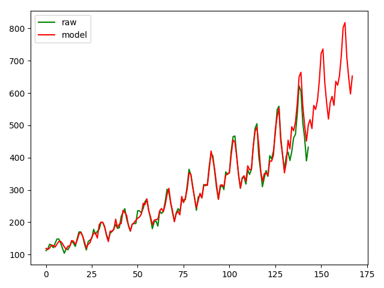

# seasonal_ts

Process time series with seasonal component and exogenous variable.

Using **SARIMA** model. For theory and details see my notebook [Time Series](https://blessbingo.gitbook.io/garnet-tech/shi-jian-xu-lie).

Simple test with [AirPassengers Dataset](https://www.analyticsvidhya.com/wp-content/uploads/2016/02/AirPassengers.csv) was conducted in `main.py`

Plotting:

